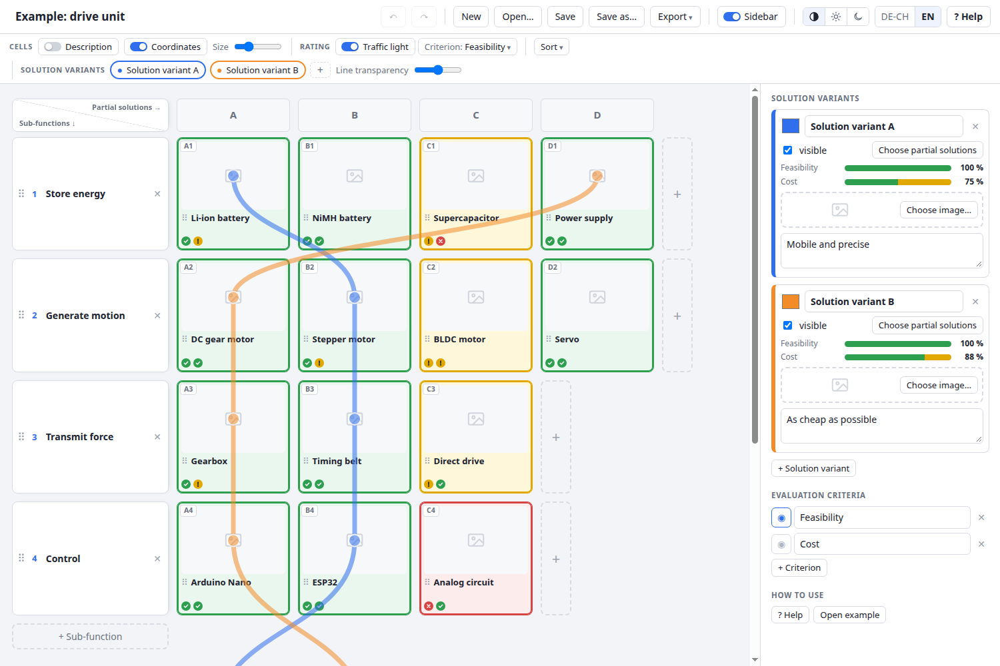
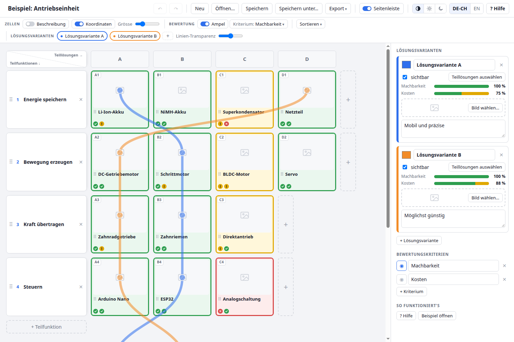

# Morphological Box

**A free, simple tool for the morphological box (Zwicky box) – right in your browser.**
No installation, no account, no data upload.

👉 **Open the tool: https://master-d1990.github.io/morphological-box/**

[English](#english) · [Deutsch](#deutsch) · [For developers](#for-developers)



---

## English

### What is a morphological box?

A morphological box is a method for finding solutions to a technical problem in a systematic way:

1. Break the problem into **sub-functions** (e.g. *store energy*, *generate motion*, *control*).
2. For each sub-function, collect several possible **partial solutions** (e.g. battery, power supply, supercapacitor).
3. Combine one partial solution per sub-function into a **solution variant**. This gives you many possible overall concepts at a glance.

Many people do this in Excel, but sketches, ratings and comparisons quickly get messy there. This tool is made for exactly that.

### What can the tool do?

- **Grid of sub-functions and partial solutions:** add, rename and rearrange them by drag & drop. Excel-like **coordinates** (e.g. “B2”) make it easy to talk about a cell in a team.
- **Images and sketches:** drag a picture onto a box, or select a box and paste with `Ctrl+V` (e.g. a screenshot or a photo of a hand sketch). Images are scaled down automatically.
- **Traffic-light rating with reasons:** rate every partial solution green / yellow / red, with a written reason, for as many criteria as you like (e.g. feasibility, cost, weight).
- **Solution variants as coloured lines:** pick one partial solution per row, and the solution variant is drawn as a see-through coloured line across the box. Several solution variants can be compared side by side.
- **Solution variant overview:** a table below the box compares all solution variants, with scores per criterion, notes and sketches of each overall concept.
- **Sorting** of partial solutions by rating, overall score or alphabetically.
- **Export** to PDF (print), **Excel** (with all images, colours and ratings) or CSV.
- **Dark mode**, **English and Swiss German**, built-in help (**? Help**).

### How to use it

1. **Open the tool** using the link above. It runs in any modern browser (Chrome, Firefox, Edge, Safari).
2. The first time you open it, you see an **example** and a short guide. Have a look around, then click **New** to start your own box. You can bring the example back any time via **? Help → Open example**.
3. **Click a box** to edit its title, description, image and rating in the sidebar on the right.
4. **Create a solution variant** with the **+** button, then click one partial solution per row. Click **Done** when you are finished.
5. **Save** your work as a file with **Save**. You can open it again later with **Open…**, or send it to someone else.
6. **Export** (top) prints the box as PDF or creates an Excel or CSV file.

Click **? Help** (top right) for a short guide with all keyboard shortcuts.

### Where is my data stored?

**Only on your own computer.** The tool does not upload anything to a server.

- While you work, your current state is cached automatically in your browser.
- That browser cache is **not a backup**. It is lost if you clear your browser data or switch to another browser or computer. Click **Save** regularly. This creates a `.kasten.json` file that contains everything, including all images.

### Working together

Save the file to a shared folder (e.g. OneDrive, Google Drive, Dropbox, Syncthing). Others open it with **Open…**, make their changes and save again.

Only one person should edit the file at a time. Otherwise the last person to save overwrites the others' changes.

### Use it offline

You can also download [`index.html`](index.html) and double-click it. The tool then works completely without internet.

### FAQ

**My box is gone!**
The browser cache was probably cleared, or you opened the tool in a different browser or a private window. Open your last saved `.kasten.json` with **Open…**. This is why regular saving matters.

**Can I open the Excel export without Microsoft Excel?**
Yes, for example with the free LibreOffice Calc, including the images.

**Can I continue working on an exported Excel file in the tool?**
No. The export is one-way. Always keep the `.kasten.json` file as your working file.

**Does it work on a tablet or phone?**
It opens, but it is designed for a computer with mouse and keyboard. Drag & drop and keyboard shortcuts work best there.

### Questions, bugs, ideas

Please open an [issue](https://github.com/Master-D1990/morphological-box/issues).

---

## Deutsch

👉 **Tool auf Deutsch öffnen: https://master-d1990.github.io/morphological-box/?lang=de**



### Was ist ein morphologischer Kasten?

Der morphologische Kasten ist eine Methode, um für ein technisches Problem systematisch Lösungen zu finden:

1. Das Problem wird in **Teilfunktionen** zerlegt (z. B. *Energie speichern*, *Bewegung erzeugen*, *Steuern*).
2. Für jede Teilfunktion werden mehrere mögliche **Teillösungen** gesammelt (z. B. Akku, Netzteil, Superkondensator).
3. Pro Teilfunktion wird eine Teillösung gewählt und zu einer **Lösungsvariante** kombiniert. So entstehen auf einen Blick viele mögliche Gesamtkonzepte.

Viele machen das in Excel, aber mit Skizzen, Bewertungen und Vergleichen wird es dort schnell unübersichtlich. Genau dafür ist dieses Tool gedacht.

### Was kann das Tool?

- **Raster aus Teilfunktionen und Teillösungen:** hinzufügen, umbenennen und per Drag & Drop umsortieren. **Koordinaten** wie in Excel (z. B. «B2») erleichtern die Abstimmung im Team.
- **Bilder und Skizzen:** Bild auf ein Feld ziehen oder ein Feld anklicken und mit `Strg+V` einfügen (z. B. einen Screenshot oder ein Handyfoto einer Handskizze). Bilder werden automatisch verkleinert.
- **Ampelbewertung mit Begründung:** jede Teillösung grün / gelb / rot bewerten, mit schriftlicher Begründung, für beliebig viele Kriterien (z. B. Machbarkeit, Kosten, Gewicht).
- **Lösungsvarianten als farbige Linien:** pro Zeile eine Teillösung anklicken, und die Lösungsvariante wird als durchsichtige farbige Linie über den Kasten gezeichnet. Mehrere Lösungsvarianten lassen sich direkt vergleichen.
- **Übersicht der Lösungsvarianten:** Eine Tabelle unter dem Kasten vergleicht alle Lösungsvarianten, mit Bewertung pro Kriterium, Notizen und Skizzen des jeweiligen Gesamtkonzepts.
- **Sortieren** der Teillösungen nach Ampel, Gesamtbewertung oder alphabetisch.
- **Export** als PDF (Drucken), **Excel** (mit allen Bildern, Farben und Bewertungen) oder CSV.
- **Darkmode**, **Deutsch (Schweiz) und Englisch**, eingebaute Hilfe (**? Hilfe**).

### So geht's

1. **Tool öffnen** über den Link oben. Es läuft in jedem aktuellen Browser (Chrome, Firefox, Edge, Safari).
2. Beim ersten Öffnen siehst du ein **Beispiel** und eine kurze Anleitung. Schau dich um und klicke dann auf **Neu**, um deinen eigenen Kasten anzulegen. Das Beispiel holst du jederzeit über **? Hilfe → Beispiel öffnen** zurück.
3. **Ein Feld anklicken**, um Titel, Beschreibung, Bild und Bewertung in der Seitenleiste rechts zu bearbeiten.
4. **Lösungsvariante anlegen** mit dem **+**-Knopf, dann pro Zeile eine Teillösung anklicken. Mit **Fertig** abschliessen.
5. Mit **Speichern** sicherst du deine Arbeit als Datei. Später öffnest du sie wieder mit **Öffnen…** oder schickst sie jemandem.
6. **Export** (oben) druckt den Kasten als PDF oder erstellt eine Excel- bzw. CSV-Datei.

Ein Klick auf **? Hilfe** (oben rechts) zeigt eine Kurzanleitung mit allen Tastenkürzeln.

### Wo werden meine Daten gespeichert?

**Nur auf deinem eigenen Computer.** Das Tool lädt nichts auf einen Server.

- Während du arbeitest, wird der aktuelle Stand automatisch im Browser zwischengespeichert.
- Dieser Zwischenspeicher ist **keine Sicherung**. Er geht verloren, wenn du die Browserdaten löschst oder den Browser oder Computer wechselst. Klicke deshalb regelmässig auf **Speichern**. So entsteht eine `.kasten.json`-Datei, die alles enthält, auch alle Bilder.

### Gemeinsam arbeiten

Speichere die Datei in einem geteilten Ordner (z. B. OneDrive, Google Drive, Dropbox, Syncthing). Andere öffnen sie mit **Öffnen…**, machen ihre Änderungen und speichern wieder.

Es sollte immer nur eine Person gleichzeitig daran arbeiten. Sonst überschreibt, wer zuletzt speichert, die Änderungen der anderen.

### Offline nutzen

Du kannst [`index.html`](index.html) auch herunterladen und per Doppelklick öffnen. Dann funktioniert das Tool komplett ohne Internet.

### Häufige Fragen

**Mein Kasten ist weg!**
Vermutlich wurden die Browserdaten gelöscht, oder du hast das Tool in einem anderen Browser bzw. in einem privaten Fenster geöffnet. Öffne deine zuletzt gespeicherte `.kasten.json` mit **Öffnen…**. Darum ist regelmässiges Speichern wichtig.

**Kann ich den Excel-Export ohne Microsoft Excel öffnen?**
Ja, zum Beispiel mit dem kostenlosen LibreOffice Calc, inklusive Bilder.

**Kann ich eine exportierte Excel-Datei wieder im Tool weiterbearbeiten?**
Nein. Der Export geht nur in eine Richtung. Behalte immer die `.kasten.json` als Arbeitsdatei.

**Funktioniert es auf Tablet oder Handy?**
Es lässt sich öffnen, ist aber für Computer mit Maus und Tastatur gedacht. Drag & Drop und Tastenkürzel funktionieren dort am besten.

### Fragen, Fehler, Ideen

Bitte ein [Issue](https://github.com/Master-D1990/morphological-box/issues) eröffnen.

---

## For developers

### Structure

The whole tool is a single file, [`index.html`](index.html): HTML, CSS and plain JavaScript, **no dependencies and no build step**. What is in the repository is exactly what runs. This keeps the tool usable offline with a double-click.

To work on it, edit `index.html` and open it in a browser. GitHub Pages serves the `main` branch directly.

Main parts of the script, in order:

| Part | What it does |
|---|---|
| `const L = { de: {…}, en: {…} }` | All UI texts (German in Swiss spelling, English) |
| Model, undo | Project data `P`, images `IMG`, undo/redo via JSON snapshots |
| Rendering | Grid, variant lines (SVG overlay), sidebar, overview table |
| Files, autosave | Save/open `.kasten.json`, browser cache in IndexedDB |
| Export | Own `.xlsx` writer (ZIP + SpreadsheetML), CSV, print layout |

### File format (`.kasten.json`)

```json
{
  "format": "morphologischer-kasten",
  "version": 1,
  "project": {
    "title": "…",
    "criteria": [ { "id": "k1", "name": "Feasibility" } ],
    "rows": [ { "id": "r1", "name": "Store energy", "cells": [
      { "id": "c1", "title": "Li-ion battery", "desc": "…", "img": "i1",
        "ratings": { "k1": { "level": "g", "reason": "…" } } } ] } ],
    "variants": [ { "id": "v1", "name": "…", "color": "#2f6fed", "visible": true,
      "note": "…", "picks": { "r1": "c1" }, "imgs": ["i2"] } ],
    "settings": { "cellW": 170, "lineOp": 0.55, "showDesc": false, "coords": true }
  },
  "images": { "i1": "data:image/webp;base64,…" }
}
```

- Everything is linked by IDs, not positions, so sorting and moving never break solution variants.
- `level` is `g` / `y` / `r` (green / yellow / red) or empty.
- Images are stored once in `images` and referenced by ID.

**Changing the format:** raise `SCHEMA_VERSION` and add a step to `MIGRATIONS` that upgrades a file from the previous version. Older files are then upgraded step by step when opened. Files from a newer version are refused with a message instead of being misread.

### Adding a language

1. Copy the `en` block in `const L` (e.g. as `fr`) and translate the texts, including the example project under `sample`.
2. Add a button for it in `#langSeg` in the HTML.
3. Allow the new code where the language is detected (search for `LANG=`).

Pull requests are welcome.

---

## License

[MIT](LICENSE): free to use, change and share, also commercially.
